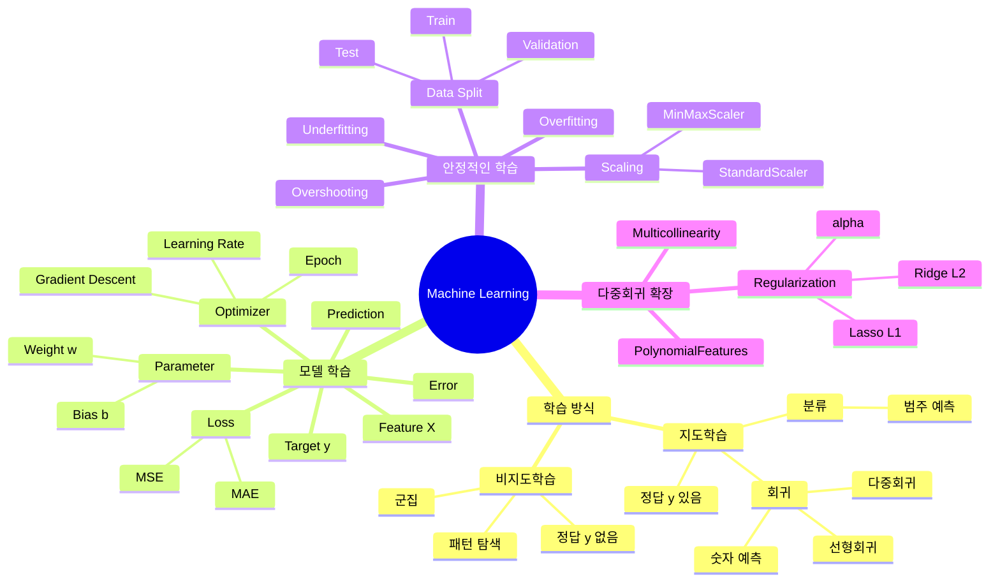

# TIL | 2026-08-27 | Machine Learning 경사하강법·데이터 분할·다중회귀·규제

> **머신러닝으로 자동화 추천이 된다는 건 알고 있었지만... 이렇게 복잡할 줄은 몰랐네...**

> 개별 용어를 외우는 것보다 `데이터 → 모델 → 예측 → 오차 → Loss → 파라미터 조정 → 평가 → 과적합 통제`라는 전체 흐름을 먼저 이해하는 것이 중요했다.

---

## 0. 전체 구조 — 머신러닝 마인드맵



### 가장 중요한 한 줄 흐름

```text
Feature(X)
→ Model
→ Prediction(ŷ)
→ 실제값(y)과 비교
→ Error
→ Loss
→ Parameter(w, b) 조정
→ Validation으로 점검
→ Test로 최종 평가
```

---

## 1. What — 무엇을 배웠는가?

### 2장 2강: 경사하강법, 옵티마이저 및 데이터 분할

- **경사하강법(Gradient Descent)**: Loss가 작아지는 방향으로 가중치를 조금씩 수정하는 최적화 방법
- **Learning Rate**: 한 번에 가중치를 얼마나 크게 수정할지 정하는 보폭
- **Epoch**: 전체 Train 데이터를 한 번 학습하는 단위
- **Parameter**: 모델이 학습해서 찾는 값 (`w`, `b`)
- **Hyperparameter**: 사람이 정하는 값 (`learning_rate`, `epoch`, `alpha` 등)
- **Train / Validation / Test**: 학습, 중간 점검, 최종 평가를 분리하기 위한 데이터 구성
- **Scaling**: Feature들의 숫자 크기 차이를 줄이는 전처리

### 3장 1강: 다중 회귀와 규제 모델

- **다중 선형회귀**: 여러 Feature를 사용해 하나의 연속형 Target을 예측
- **다중공선성(Multicollinearity)**: 독립 변수끼리 지나치게 강한 상관관계를 가져 각 변수의 독립적인 기여도를 구분하기 어려운 현상
- **PolynomialFeatures**: 기존 Feature를 제곱항·상호작용항 등으로 확장
- **Ridge(L2)**: 큰 가중치에 제곱 벌점을 부여해 가중치를 전체적으로 줄임
- **Lasso(L1)**: 가중치 절댓값에 벌점을 부여하며 일부 가중치를 0으로 만들 수 있음
- **alpha**: 규제 강도를 조절하는 하이퍼파라미터

---

## 2. Why — 왜 필요한가?

### 머신러닝은 왜 필요한가?

일반 프로그래밍은 사람이 규칙을 직접 작성한다.

```text
데이터 + 사람이 만든 규칙
→ 결과
```

머신러닝은 사람이 모든 규칙을 직접 작성하기 어려운 문제에서 데이터로부터 패턴을 학습한다.

```text
데이터
→ 패턴 학습
→ 모델
→ 새로운 데이터 예측
```

### 지도학습과 비지도학습은 왜 나누는가?

**지도학습**은 정답 `y`가 있다.

```text
X(공부시간, 결석횟수 등)
→ y(성적)
```

정답이 있기 때문에 모델의 예측이 얼마나 틀렸는지 계산할 수 있다.

- 회귀: 연속된 숫자 예측
- 분류: 범주 예측

**비지도학습**은 정답 `y`가 없다.

```text
고객 구매 데이터
→ 정답 없음
→ 비슷한 고객끼리 묶거나 숨은 패턴 탐색
```

### Loss는 왜 필요한가?

모델은 처음부터 정답을 알지 못한다.

```text
실제값 y = 80
예측값 ŷ = 70
→ Error = 차이 발생
```

여러 Error를 하나의 기준으로 계산해 모델이 전체적으로 얼마나 틀렸는지를 나타내는 값이 **Loss**다.

```text
Prediction
→ Error
→ Loss
→ Loss를 줄이는 방향으로 학습
```

### MSE와 L2의 제곱은 같은 의미인가?

아니다. 둘 다 제곱을 사용하지만 **벌점을 주는 대상이 다르다.**

```text
MSE
→ 예측 오차를 제곱
→ 큰 예측 실수에 큰 벌점

L2 규제
→ 가중치를 제곱
→ 지나치게 큰 가중치에 큰 벌점
```

### 가중치는 왜 조정하고, 또 왜 규제하는가?

```text
가중치 조정
= 예측을 더 잘하기 위해

가중치 규제
= Train 데이터에 지나치게 맞지 않게 하기 위해
```

Feature가 많아지고 모델이 복잡해질수록 Train 데이터의 작은 특징이나 노이즈까지 따라갈 수 있다. 이때 새로운 데이터에서 성능이 떨어지는 **과적합(Overfitting)**이 발생할 수 있다.

규제는 Loss에 가중치 벌점을 더해 모델이 지나치게 복잡해지는 것을 억제한다.

---

## 3. How — 어떻게 작동하는가?

### 3-1. 경사하강법과 Learning Rate

```text
w_new = w_old - learning_rate × gradient
```

핵심은 **Loss가 작아지는 방향으로 가중치를 이동시키는 것**이다.

#### Learning Rate = 보폭

```text
Learning Rate 너무 큼
→ 한 번에 너무 크게 이동
→ 최적점을 지나침
→ Overshooting
→ 진동 또는 발산 가능
```

```text
Learning Rate 너무 작음
→ 한 번에 아주 조금 이동
→ 학습 속도가 매우 느림
```

```text
적절한 Learning Rate
→ 큰 이동
→ 점점 작은 이동
→ 최적점 근처로 수렴
```

### 3-2. Parameter와 Hyperparameter

```text
w, b
= 모델이 데이터로부터 학습
= Model Parameter

Learning Rate, Epoch, alpha
= 사람이 설정
= Hyperparameter
```

이 구분은 계속 반복해서 확인할 필요가 있다.

---

## 4. Scaling — 왜 하는가?

Feature들의 숫자 크기는 크게 다를 수 있다.

```text
집 면적 = 4,000
가격 관련 수치 = 500,000
학교 평점 = 4
```

경사 기반 최적화나 규제 모델에서는 이런 스케일 차이가 크면 학습이 비효율적이거나 불안정해질 수 있다.

### MinMaxScaler

```text
최솟값 → 0
최댓값 → 1
```

주로 값을 0~1 범위로 변환한다.

### StandardScaler

```text
평균 → 0
표준편차 → 1
```

공식:

```text
Z = (X - 평균) / 표준편차
```

Z-score는 값이 평균에서 표준편차 몇 개만큼 떨어져 있는지를 나타낸다.

### 중요한 보강: Scaling은 선형회귀 자체에 항상 필수는 아니다

Scikit-learn의 일반적인 `LinearRegression()`은 해석적으로 해를 구하는 방식이기 때문에 **단순히 선형회귀를 실행하기 위해 스케일링이 반드시 필요한 것은 아니다.**

하지만 다음과 같은 경우 Scaling의 중요성이 커진다.

```text
직접 경사하강법 구현
경사 기반 최적화 모델
Ridge / Lasso처럼 가중치 크기에 규제를 거는 모델
Feature 간 숫자 크기 차이가 매우 큰 경우
```

즉:

> **Scaling = 모든 선형회귀의 필수 절차 X**
>
> **Scaling = 특정 최적화·규제 상황에서 학습 안정성과 비교 가능성을 높이는 중요한 전처리 O**

---

## 5. Train / Validation / Test와 `train_test_split`

### 역할

```text
Train
→ 모델 학습
→ w, b 결정

Validation
→ 중간 점검
→ 하이퍼파라미터 선택
→ 과적합 여부 확인

Test
→ 모든 설정이 끝난 뒤 최종 일반화 성능 평가
```

### `train_test_split`

```python
from sklearn.model_selection import train_test_split
```

구조:

```text
sklearn
└─ model_selection
   └─ train_test_split
```

기본 사용:

```python
X_train, X_test, y_train, y_test = train_test_split(
    X,
    y,
    test_size=0.2,
    random_state=42
)
```

읽는 순서:

```text
X와 y를 같이 받는다
→ 같은 행의 X와 y 짝을 유지한다
→ 데이터를 섞는다
→ test_size만큼 Test로 분리한다
→ 나머지는 Train으로 분리한다
```

### 왜 X와 y를 같이 나누는가?

```text
학생 A의 공부시간 ↔ 학생 A의 점수
학생 B의 공부시간 ↔ 학생 B의 점수
```

X와 y를 따로 랜덤 분할하면 이 짝이 깨질 수 있기 때문에 `train_test_split(X, y)`로 함께 분리한다.

### 자주 쓰는 옵션

```text
test_size=0.2
→ 전체의 20%를 Test로 사용

random_state=42
→ 같은 랜덤 분할을 재현

shuffle=True
→ 분할 전에 섞기 (기본값 True)
```

### 중요한 보강: `stratify=y`는 모든 회귀 문제에 그대로 쓰는 옵션이 아니다

`stratify`는 주로 **분류 문제에서 클래스 비율을 유지하기 위해 사용**한다.

예:

```text
전체 데이터
A 클래스 70%
B 클래스 30%

Train / Test에서도
A 70%, B 30%에 가깝게 유지
```

연속형 집값·점수 같은 일반적인 회귀 Target에는 그대로 적용하지 않는 경우가 많다.

즉:

```text
분류
→ stratify=y 자주 사용

일반적인 연속형 회귀
→ 보통 그대로 사용하지 않음
```

---

## 6. Scikit-learn 코드 흐름

세부 문법보다 먼저 이 흐름을 읽는다.

```python
X = df[['SquareFeet']]
y = df['Price']

model = LinearRegression()
model.fit(X, y)
y_pred = model.predict(X)
```

읽는 순서:

```text
X와 y 준비
→ 모델 생성
→ fit() 학습
→ predict() 예측
```

### `fit()`은 객체에 따라 배우는 것이 다르다

```text
model.fit(X, y)
→ X와 y 관계를 학습
→ w, b 같은 모델 파라미터 저장

scaler.fit(X)
→ 평균·표준편차 또는 최소·최대 같은 변환 기준 저장
```

### `transform()`

```text
fit에서 배운 기준
→ 실제 데이터에 적용
```

```python
scaler.fit(X)
X_scaled = scaler.transform(X)
```

또는:

```python
X_scaled = scaler.fit_transform(X)
```

### 왜 X는 대괄호가 두 겹인가?

```python
X = df[['SquareFeet']]
y = df['Price']
```

`X`는 scikit-learn에서 일반적으로 **2차원 형태 `(행, Feature 수)`**를 기대한다.

```text
df['SquareFeet']
→ Series
→ 1차원

df[['SquareFeet']]
→ DataFrame
→ 2차원
```

그래서 Feature가 하나여도 `X`는 보통 이중 대괄호를 사용한다.

`y`는 정답 벡터이므로 1차원 Series 형태를 자주 사용한다.

---

## 7. 다중회귀 → 다중공선성 → 규제

### 다중 선형회귀

```text
ŷ = w1X1 + w2X2 + w3X3 + ... + b
```

Feature가 여러 개이므로 Feature마다 각자의 가중치가 있다.

### 다중공선성

독립 변수끼리 지나치게 비슷한 정보를 가지면:

```text
Feature A와 B가 거의 같이 움직임
→ 누가 결과에 얼마나 영향을 줬는지 구분 어려움
→ 회귀 계수가 불안정해질 수 있음
```

### Ridge — L2

```text
Loss = MSE + alpha × Σ(w²)
```

- 큰 가중치에 큰 벌점
- 가중치를 전체적으로 작게 만듦
- 보통 가중치를 정확히 0으로 만들지는 않음

### Lasso — L1

```text
Loss = MSE + alpha × Σ|w|
```

- 일부 가중치를 정확히 0으로 만들 수 있음
- Feature Selection 효과 가능

### alpha

```text
alpha 작음
→ 규제 약함

alpha 큼
→ 규제 강함
```

너무 큰 alpha는 필요한 가중치까지 지나치게 줄여 **과소적합**을 만들 수 있다.

---

## 8. 로그와 `np.logspace()`

로그는 NumPy에서 생긴 개념이 아니라 수학 개념이다.

```text
2³ = 8
↕
log₂(8) = 3
```

오늘 코드:

```python
alphas = np.logspace(-3, 3, 200)
```

의 목적은 alpha 후보를 작은 값부터 큰 값까지 넓은 범위로 탐색하는 것이다.

대략:

```text
0.001 → 0.01 → 0.1 → 1 → 10 → 100 → 1000
```

처럼 배수 단위의 넓은 범위를 효율적으로 다룰 수 있다.

---

## 9. 반복해서 학습해야 할 코드

### 기본 import

```python
import pandas as pd
import numpy as np
import matplotlib.pyplot as plt

from sklearn.model_selection import train_test_split
from sklearn.preprocessing import StandardScaler, MinMaxScaler, PolynomialFeatures
from sklearn.linear_model import LinearRegression, Ridge, Lasso
```

주의:

```python
from matplotlib.pyplot as plt  # X
import matplotlib.pyplot as plt  # O
```

### Feature / Target

```python
X = df[['failures', 'goout', 'health']]
y = df['G3']
```

### StandardScaler

```python
scaler = StandardScaler()
X_scaled = scaler.fit_transform(X)
```

### train_test_split

```python
X_train, X_test, y_train, y_test = train_test_split(
    X,
    y,
    test_size=0.2,
    random_state=42
)
```

### Ridge 기본 흐름

```python
model = Ridge(alpha=0)
model.fit(X, y)

for feature, coef in zip(X.columns, model.coef_):
    print(f'{feature}: {coef}')

print(f'intercept: {model.intercept_}')
```

### Ridge / Lasso alpha 반복

```python
alphas = np.logspace(-3, 3, 200)

ridge_coefs = []
lasso_coefs = []

for alpha in alphas:
    ridge = Ridge(alpha=alpha)
    ridge.fit(X_scaled, y)
    ridge_coefs.append(ridge.coef_)

    lasso = Lasso(alpha=alpha)
    lasso.fit(X_scaled, y)
    lasso_coefs.append(lasso.coef_)
```

`NameError`가 나오면 반복문 자체보다 먼저 다음 이름이 앞에서 정의되었는지 확인한다.

```text
alphas
Ridge
Lasso
X_scaled
y
```

---

## 10. 2026-08-28 아침 복습에서 추가로 확인한 내용

어제 TIL을 다시 읽으면서 특히 아래 내용을 추가로 확인했다.

### 1) Learning Rate는 가중치 자체가 아니다

```text
Weight
→ 모델이 학습하는 값

Learning Rate
→ Weight를 얼마나 크게 수정할지 정하는 보폭
```

### 2) Scaling은 무조건 해야 하는 공식 단계가 아니다

```text
LinearRegression 자체
→ 항상 필수 X

경사 기반 학습 / Ridge / Lasso / 큰 Feature 스케일 차이
→ Scaling 중요성 증가
```

### 3) `stratify=y`는 분류용이라는 맥락을 먼저 본다

코드 옵션은 모델 종류와 Target의 성격을 보고 선택해야 한다.

### 4) Scikit-learn 코드는 문법보다 흐름을 먼저 읽는다

```text
X, y 준비
→ 모델 생성
→ fit()
→ predict()
→ 평가
```

### 5) `X = df[['컬럼']]`의 이중 대괄호는 2차원 구조를 유지하기 위한 것

단순히 외워야 할 기호가 아니라 scikit-learn이 기대하는 입력 모양과 연결해서 이해한다.

---

## 11. KPT 회고

### Keep — 계속할 것

- 모르는 용어를 그냥 넘기지 않고 정의부터 확인한다.
- 수식보다 먼저 `왜 필요한가?`를 묻는다.
- 코드를 한 줄씩 보기 전에 전체 실행 흐름을 먼저 잡는다.
- 비슷한 단어를 비교해서 구분한다.

```text
Overfitting ≠ Overshooting
Parameter ≠ Hyperparameter
Weight ≠ Learning Rate
fit() ≠ transform()
MSE의 제곱 ≠ L2의 제곱 목적
```

### Problem — 반복 취약점 후보

아직 한두 번의 질문만으로 확정 취약점으로 보지는 않지만, 반복 복습이 필요한 후보는 다음과 같다.

- 머신러닝 전체 흐름 속에서 개별 개념의 위치 찾기
- Parameter / Hyperparameter 구분
- Loss / Error / 규제항 구분
- Scaling이 필요한 상황 판단
- `train_test_split` 옵션의 의미와 적용 상황
- Scikit-learn 입력 데이터의 차원 (`X` 2차원, `y` 1차원)
- 라이브러리 → 모듈 → 클래스/함수 구조 읽기

### Try — 다음 복습 방향

오늘 3강 남은 내용을 학습한 후, 1~3강 전체를 다음 구조로 다시 연결한다.

```text
문제 정의
→ 데이터 X/y
→ 전처리
→ 모델 선택
→ fit
→ prediction
→ loss / 평가
→ 과적합 확인
→ 규제 / 하이퍼파라미터 조정
```

---

## 12. 이해도 점검

- [x] Feature와 Target의 역할을 설명할 수 있다.
- [x] Loss가 왜 필요한지 설명을 보면 이해할 수 있다.
- [x] Learning Rate가 너무 크면 Overshooting이 생기는 이유를 설명할 수 있다.
- [x] Parameter와 Hyperparameter를 구분할 수 있다.
- [x] MinMaxScaler와 StandardScaler의 기본 목적을 구분할 수 있다.
- [x] Scaling이 모든 LinearRegression에서 절대적으로 필수는 아니라는 점을 이해했다.
- [x] `stratify=y`가 주로 분류 문제에서 사용된다는 점을 이해했다.
- [x] `X = df[['컬럼']]`이 2차원 DataFrame을 만드는 코드라는 것을 이해했다.
- [ ] `train_test_split` 코드를 예제 없이 바로 작성할 수 있다.
- [ ] Ridge / Lasso 코드를 예제 없이 처음부터 작성할 수 있다.
- [ ] 전체 머신러닝 학습 구조를 자료 없이 완전히 설명할 수 있다.

### 현재 이해도

- [ ] ⭐ 아직 거의 이해하지 못했다.
- [ ] ⭐⭐ 일부만 이해했다.
- [x] ⭐⭐⭐ 설명을 보면 전체 흐름은 이해하지만 코드와 세부 개념은 반복이 필요하다.
- [ ] ⭐⭐⭐⭐ 대부분 이해했고 간단한 코드를 작성할 수 있다.
- [ ] ⭐⭐⭐⭐⭐ 혼자 작성하고 다른 사람에게 설명할 수 있다.

---

## 13. 복습 문제 — 6문제

> 정답은 바로 보지 않고 먼저 내 말로 설명한다.

### 문제 1 — 전체 구조

지도학습에서 `X`, `y`, `Prediction`, `Error`, `Loss`, `Parameter Update`가 어떤 순서로 연결되는지 설명해보세요.

### 문제 2 — Learning Rate

Learning Rate가 너무 클 때와 너무 작을 때 각각 어떤 문제가 발생하는지 설명하고, **Overshooting이 왜 발생하는지** 말해보세요.

### 문제 3 — Scaling

`LinearRegression()`을 사용할 때 Scaling이 항상 필수는 아닌데도 `StandardScaler`나 `MinMaxScaler`를 사용하는 이유는 무엇인가요? 특히 Ridge/Lasso 또는 경사 기반 학습과 연결해서 설명해보세요.

### 문제 4 — 데이터 분할

다음 코드에서 각 부분의 역할을 설명해보세요.

```python
X_train, X_test, y_train, y_test = train_test_split(
    X, y,
    test_size=0.2,
    random_state=42
)
```

그리고 `stratify=y`를 일반적인 연속형 회귀 문제에 무조건 넣으면 안 되는 이유도 말해보세요.

### 문제 5 — Scikit-learn 코드 읽기

다음 코드의 실행 순서를 말로 설명하고, `X`만 대괄호가 두 겹인 이유를 설명해보세요.

```python
X = df[['SquareFeet']]
y = df['Price']

model = LinearRegression()
model.fit(X, y)
y_pred = model.predict(X)
```

### 문제 6 — 규제

Ridge와 Lasso가 왜 필요한지 설명하고, 아래 세 가지를 구분해보세요.

```text
가중치 조정
가중치 규제
alpha
```

추가로 Ridge(L2)와 Lasso(L1)의 가장 큰 차이도 설명해보세요.

---

## 관련 자료

- 2장 2강 교안: `경사하강법, 옵티마이저 및 데이터 분할`
- 3장 1강 교안: `다중 회귀와 규제 모델`
- 예습 노트: `[MACHINE_LEARNING]_선형회귀-오차평가-경사하강법-데이터분할_예습정리.md`
