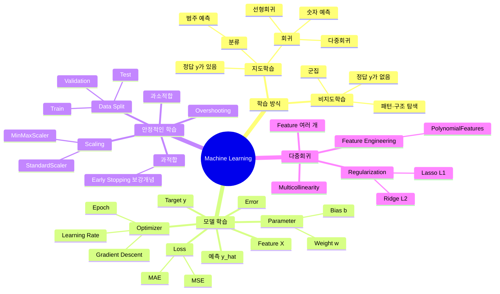

# TIL | 2026-08-27 | Machine Learning 경사하강법·데이터 분할·다중회귀·규제

> **머신러닝으로 자동화 추천이 된다는 건 알고 있었지만... 이렇게 복잡할 줄은 몰랐네...**

> 오늘은 개별 수식이나 코드를 외우는 것보다 **머신러닝이 어떤 흐름으로 학습하고, 왜 오차를 줄이고, 왜 데이터를 나누고, 왜 규제를 거는지 전체 구조를 먼저 잡는 것이 중요하다고 느꼈다.**

---

## 0. 오늘 전체 구조 — 머신러닝 마인드맵



### 오늘 배운 내용을 한 흐름으로

```text
데이터 준비
↓
Feature(X)와 Target(y) 구분
↓
모델이 예측값(ŷ) 생성
↓
실제값(y)과 비교
↓
Error 발생
↓
Loss로 전체 오차를 수치화
↓
Loss가 작아지는 방향으로 가중치(w), 편향(b) 조정
↓
학습 반복
↓
Validation으로 중간 점검
↓
과적합 여부와 하이퍼파라미터 확인
↓
Test로 최종 일반화 성능 평가

Feature가 많아지고 모델이 복잡해짐
↓
가중치가 불안정하거나 과적합 위험 증가
↓
Ridge / Lasso 규제로 가중치를 통제
```

---

## 1. What — 무엇을 배웠는가?

### 2장 2강: 경사하강법, 옵티마이저 및 데이터 분할

- **경사하강법(Gradient Descent)**은 Loss가 작아지는 방향으로 모델 파라미터를 조금씩 업데이트하는 최적화 방법이다.
- 모델 파라미터는 모델이 학습하면서 찾는 값으로, 선형회귀에서는 대표적으로 **가중치 `w`와 편향 `b`**가 있다.
- **학습률(Learning Rate)**은 한 번 업데이트할 때 얼마나 크게 움직일지를 정하는 보폭이다.
- 학습률이 너무 크면 최저점을 지나치는 **Overshooting**이 발생하고, 심하면 Loss가 커지며 발산할 수 있다.
- **Epoch**는 전체 Train 데이터를 한 번 학습하는 단위다.
- Learning Rate, Epoch 등은 사람이 설정하는 **하이퍼파라미터(Hyperparameter)**다.
- 데이터를 Train / Validation / Test로 분리해 모델이 훈련 데이터를 외운 것인지, 새로운 데이터에도 잘 적용되는지 확인한다.
- 스케일링은 Feature의 숫자 크기를 맞춰 학습을 안정적으로 돕는다.

### 3장 1강: 다중 회귀와 규제 모델

- **단순 선형회귀**는 하나의 Feature로 값을 예측한다.
- **다중 선형회귀**는 여러 Feature를 함께 이용해 하나의 Target을 예측한다.
- 다중회귀에서는 Feature마다 각각의 가중치가 존재한다.
- 독립변수끼리 지나치게 강한 상관관계를 가지면 **다중공선성(Multicollinearity)**이 발생해 각 Feature의 독립적인 기여도를 해석하기 어려워질 수 있다.
- **특성 공학(Feature Engineering)**은 기존 Feature를 조합하거나 변환해 새로운 Feature를 만드는 과정이다.
- `PolynomialFeatures`를 사용하면 제곱항과 상호작용항 등 다항 특성을 만들 수 있다.
- Feature가 지나치게 많아지거나 가중치가 과도하게 커지면 과적합 위험이 증가할 수 있다.
- 이를 완화하기 위해 **규제(Regularization)**를 사용한다.
- **Ridge(L2)**는 가중치의 제곱합을 Loss에 추가해 큰 가중치를 억제한다.
- **Lasso(L1)**는 가중치의 절댓값 합을 Loss에 추가하며, 중요도가 낮은 Feature의 가중치를 정확히 0으로 만들 수 있다.

### 핵심 용어

| 용어 | 오늘 기준 의미 |
|---|---|
| Feature | 모델이 예측할 때 참고하는 입력 정보 (`X`) |
| Target / Label | 모델이 맞혀야 하는 정답 (`y`) |
| Parameter | 모델이 학습으로 찾는 값 (`w`, `b`) |
| Hyperparameter | 사람이 학습 전 설정하는 값 (`alpha`, Learning Rate, Epoch 등) |
| Loss | 모델의 예측이 전체적으로 얼마나 틀렸는지를 수치화한 값 |
| Optimizer | Loss를 줄이기 위해 파라미터를 어떻게 업데이트할지 결정하는 방법 |
| Scaling | 서로 다른 Feature의 숫자 크기를 비슷한 기준으로 맞추는 전처리 |
| Regularization | 가중치가 지나치게 커지는 것을 억제해 모델 복잡도를 통제하는 방법 |

---

## 2. Why — 왜 필요한가?

### 머신러닝은 왜 필요한가?

일반 프로그래밍은 사람이 규칙을 직접 작성한다.

```text
데이터 + 사람이 만든 규칙
→ 결과
```

머신러닝은 데이터를 통해 패턴을 학습하고 새로운 데이터에 대해 예측한다.

```text
데이터
→ 패턴 학습
→ 모델
→ 새로운 데이터 예측
```

즉 사람이 모든 경우의 규칙을 직접 작성하기 어려운 문제에서 데이터로부터 관계를 찾아 활용하기 위해 필요하다.

### 지도학습과 비지도학습은 왜 나누는가? — 보강 개념

> 이 부분은 오늘 2장 2강과 3장 1강의 핵심 주제라기보다, 머신러닝 전체 구조를 잡기 위해 추가한 보강 개념이다.

**지도학습(Supervised Learning)**은 정답 `y`가 있는 데이터로 학습한다.

```text
집 크기 / 범죄율 / 학교 평점 → 집값
X                              → y
```

정답이 있으므로 모델이 자신의 예측과 정답을 비교해 Loss를 계산할 수 있다.

- 회귀: 숫자값 예측
- 분류: 범주 예측

**비지도학습(Unsupervised Learning)**은 정답 `y`가 없다.

```text
고객의 구매 패턴 데이터
→ 정답 라벨 없음
→ 비슷한 고객끼리 묶기 / 숨은 구조 찾기
```

정답을 미리 정의하기 어려운 데이터에서 군집이나 구조를 발견하고 싶을 때 필요하다.

핵심 구분:

```text
지도학습
= 정답이 있음
= 예측을 얼마나 틀렸는지 비교 가능

비지도학습
= 정답이 없음
= 데이터 내부의 패턴과 구조를 탐색
```

### Loss는 왜 필요한가?

모델은 처음부터 정답을 정확하게 맞히지 못한다.

```text
실제값 y = 5
예측값 ŷ = 3
→ 차이 발생
```

한 데이터의 차이는 Error로 볼 수 있고, 여러 데이터의 오차를 하나의 기준으로 모아 **현재 모델이 전체적으로 얼마나 틀렸는지 평가하는 값이 Loss**다.

```text
예측
↓
Error 여러 개
↓
Loss Function
↓
현재 모델의 성적표
```

머신러닝 학습의 핵심 목표는 **Loss를 줄이는 파라미터를 찾는 것**이다.

### MSE와 MAE는 왜 필요한가?

**MAE**

```text
오차 → 절대값 → 평균
```

평균적으로 얼마나 틀렸는지 원래 데이터와 같은 단위로 직관적으로 해석하기 좋다.

**MSE**

```text
오차 → 제곱 → 평균
```

큰 예측 오차를 제곱하기 때문에 큰 실수에 더 큰 벌점을 준다.

중요한 구분:

```text
MSE
→ 큰 '예측 오차'를 크게 벌점

L2 규제
→ 큰 '가중치'를 크게 벌점
```

둘 다 제곱을 사용하지만 벌점을 주는 대상이 다르다.

### 가중치는 왜 조정하는가?

가중치는 각 Feature가 예측 결과에 얼마나 영향을 미치는지를 나타낸다.

다중회귀의 형태:

```text
ŷ = w1X1 + w2X2 + w3X3 + ... + b
```

모델은 처음부터 적절한 `w`와 `b`를 알 수 없기 때문에 예측과 Loss를 확인하면서 더 좋은 값으로 조정한다.

```text
예측
↓
Loss 계산
↓
w, b 수정
↓
다시 예측
```

즉 **가중치 조정은 더 잘 예측하기 위해 필요하다.**

### 그럼 가중치 규제는 왜 하는가?

가중치를 자유롭게 조정하게만 두면 Train 데이터의 Loss를 줄이기 위해 일부 가중치가 지나치게 커질 수 있다.

```text
Train 데이터에 지나치게 맞춤
↓
복잡한 모델
↓
새로운 데이터에서는 성능 저하 가능
↓
Overfitting
```

규제는 Loss에 가중치에 대한 추가 벌점을 붙여 모델이 너무 복잡해지는 것을 억제한다.

```text
규제 전
Loss = 예측 오차

규제 후
Loss = 예측 오차 + 가중치 벌점
```

즉:

> **가중치 조정 = 예측을 잘하기 위해**
>
> **가중치 규제 = Train 데이터에 지나치게 맞지 않도록 하기 위해**

### 과적합은 왜 발생하는가?

과적합은 모델이 데이터의 일반적인 패턴뿐 아니라 Train 데이터의 세부적인 노이즈까지 지나치게 학습할 때 발생할 수 있다.

원인이 될 수 있는 상황:

- 모델이 필요 이상으로 복잡함
- Feature가 너무 많음
- PolynomialFeatures 등으로 변수를 과도하게 증가시킴
- Train 데이터에 비해 모델 표현력이 지나치게 큼
- 너무 오래 학습해 Train 데이터에 과도하게 맞춰짐

```text
Train 성능 매우 좋음
Validation / Test 성능 저하
→ Overfitting 의심
```

반대로 학습이나 모델 표현력이 부족하면 **Underfitting(과소적합)**이 발생할 수 있다.

### Early Stopping — 수업 중 보강 개념

> 오늘 교안의 핵심 개념은 아니지만, 과적합 질문을 이해하기 위해 추가한 내용이다.

학습을 계속한다고 무조건 좋은 것은 아니다. 일반적으로 Validation 성능이 일정 기간 더 개선되지 않거나 나빠진다면 학습을 멈추는 전략을 사용할 수 있다.

```text
Train Loss 계속 감소
Validation Loss 개선 멈춤 / 증가
↓
과적합 가능성
↓
Early Stopping 고려
```

핵심은 **Train Loss 하나만 보고 멈추는 것이 아니라 Validation 성능을 함께 본다는 것**이다.

### Overshooting은 왜 발생하는가?

경사하강법에서 Learning Rate가 너무 크면 한 번에 파라미터를 너무 크게 수정한다.

```text
Learning Rate 너무 큼
↓
보폭 너무 큼
↓
Loss가 가장 낮은 지점을 지나침
↓
Overshooting
↓
진동 또는 발산 가능
```

Learning Rate가 너무 작으면 학습 속도가 지나치게 느려질 수 있다.

### 스케일링은 왜 필요한가?

Feature마다 숫자 크기가 크게 다를 수 있다.

```text
집 크기 4,000
범죄율 20
학교 평점 4
```

스케일 차이를 줄이면 경사 기반 최적화가 더 안정적이고 효율적으로 진행되는 데 도움이 될 수 있다.

**MinMaxScaler**

```text
최소값 → 0
최대값 → 1
```

**StandardScaler**

```text
평균 → 0
표준편차 → 1
```

StandardScaler의 결과인 Z-score는 **각 값이 평균에서 표준편차 몇 개만큼 떨어져 있는지** 나타내는 표준점수다.

### 데이터를 왜 Train / Validation / Test로 나누는가?

```text
Train
= 모델 학습
= 가중치 업데이트

Validation
= 학습 중간 점검
= 하이퍼파라미터 선택·조정에 참고

Test
= 모든 학습과 설정이 끝난 후 최종 평가
```

대표 예시로 60 : 20 : 20을 사용할 수 있지만 절대적인 고정 규칙은 아니다.

Test는 회귀 문제에서 단순히 `정확도`가 얼마나 올라갔는지 보는 데이터가 아니라 **처음 보는 데이터에 대한 최종 일반화 성능을 MAE, MSE, RMSE, R² 등의 평가 지표로 확인하는 데이터**다.

---

## 3. How — 어떻게 작동하는가?

### 경사하강법

가중치 업데이트 공식:

```text
w_new = w_old - learning_rate × gradient
```

수식으로는:

```text
w_new = w_old - α · ∂J/∂w
```

- `w_old`: 현재 가중치
- `w_new`: 업데이트된 가중치
- `α`: Learning Rate
- `J`: Loss / Cost Function
- `∂J/∂w`: 가중치를 바꿀 때 Loss가 어느 방향으로 얼마나 변하는지 나타내는 기울기

`-`가 붙는 이유는 기울기가 Loss가 증가하는 방향을 나타내므로 **Loss를 줄이기 위해 반대 방향으로 이동해야 하기 때문**이다.

### Parameter와 Hyperparameter

```text
Model Parameter
→ 모델이 학습으로 찾음
→ Weight, Bias

Hyperparameter
→ 사람이 학습 전에 설정
→ Learning Rate, Epoch, 규제 강도 alpha 등
```

Optimizer는 파라미터를 어떤 방식으로 업데이트할지 결정하는 최적화 방법이다.

### `fit()`과 `transform()`

오늘 반복해서 헷갈렸던 부분이다.

```text
fit()
= 데이터에서 필요한 기준을 학습

transform()
= fit에서 배운 기준을 실제 데이터에 적용
```

예:

```python
ss = StandardScaler()
ss.fit(X_sqft)              # 평균, 표준편차 계산
X_scaled = ss.transform(X_sqft)  # 표준화 실제 적용
```

모델에서는 의미가 조금 달라진다.

```python
model.fit(X, y)
```

→ `X`와 `y`의 관계를 이용해 가중치와 절편 등 모델 파라미터를 학습한다.

### MinMaxScaler

```text
X_new = (X - min) / (max - min)
```

최솟값을 0, 최댓값을 1에 대응시켜 0~1 범위로 변환한다.

### StandardScaler / Z-score

```text
Z = (X - 평균) / 표준편차
```

- `Z = 0`: 평균과 같은 위치
- `Z = 1`: 평균보다 표준편차 1개만큼 높음
- `Z = -2`: 평균보다 표준편차 2개만큼 낮음

### 데이터 분할과 Shuffle

데이터가 클래스별로 정렬되어 있다면 단순히 앞뒤로 자르는 것만으로는 Train/Test에 특정 클래스가 몰릴 수 있다.

```text
정렬된 데이터
↓
Shuffle
↓
Train / Validation / Test 분할
```

분류 문제에서는 `stratify=y`를 사용해 클래스 비율을 유지하는 방법도 있다.

### 다중 선형회귀

단순 선형회귀:

```text
ŷ = wX + b
```

다중 선형회귀:

```text
ŷ = w1X1 + w2X2 + w3X3 + ... + wpXp + b
```

Feature가 여러 개이므로 각 Feature마다 가중치가 하나씩 존재한다.

### 다중공선성

```text
Feature A와 Feature B가 거의 같은 정보
↓
둘 다 비슷하게 움직임
↓
각 Feature가 결과에 독립적으로 얼마나 기여했는지 구분 어려움
↓
가중치 해석이 불안정해질 수 있음
```

교안에서는 VIF를 다중공선성 진단 기준으로 소개했다.

### Ridge — L2 규제

```text
Loss_Ridge = MSE + α Σ(w_j²)
```

- `MSE`: 예측 오차
- `α`: 규제 강도
- `p`: Feature 개수
- `w_j²`: 각 Feature 가중치의 제곱

큰 가중치는 제곱으로 인해 큰 패널티를 받으므로 전체 가중치가 완만하게 작아지는 방향으로 학습된다.

```text
가중치 1 → 벌점 1
가중치 3 → 벌점 9
가중치 10 → 벌점 100
```

Ridge는 보통 가중치를 0에 가깝게 만들지만 정확히 0으로 만들지는 않아 Feature의 정보를 유지하는 성격이 있다.

### Lasso — L1 규제

```text
Loss_Lasso = MSE + α Σ|w_j|
```

가중치의 절댓값에 벌점을 부과한다. 일부 가중치를 정확히 0으로 만들 수 있기 때문에 **Feature Selection 효과**가 있다.

```text
중요한 Feature
→ 가중치 유지

영향이 낮은 Feature
→ 가중치 0 가능
→ 모델에서 사실상 제외
```

### L2를 많이 사용하는 이유에 대한 보강

L2가 언제나 L1보다 우수하거나 반드시 더 많이 사용된다고 단정할 수는 없다.

다만 많은 상황에서 Ridge/L2가 안정적인 기본 선택이 될 수 있는 이유는:

- 모든 Feature의 정보를 유지하면서 가중치를 줄일 수 있음
- 서로 상관된 Feature가 있을 때 특정 하나를 갑자기 제거하기보다 가중치를 분산해 안정화할 수 있음
- Feature Selection이 필요하지 않은 경우 부드러운 규제가 유리할 수 있음

반대로 실제로 불필요한 Feature를 제거하고 싶다면 Lasso/L1의 장점이 크다.

### alpha

```text
alpha 작음
→ 규제 약함
→ 가중치가 비교적 자유롭게 움직임

alpha 큼
→ 규제 강함
→ 가중치가 더 강하게 축소
```

`alpha`는 사람이 설정하는 하이퍼파라미터다.

너무 큰 alpha는 필요한 가중치까지 과도하게 줄여 과소적합을 만들 수 있으므로 적절한 값을 탐색해야 한다.

### 로그와 `np.logspace()`

로그는 NumPy의 개념이 아니라 원래 수학 개념이다.

```text
2³ = 8
↕
log₂(8) = 3
```

로그는 **밑을 몇 제곱해야 목표 숫자가 되는가**를 묻는다.

오늘 코드:

```python
alphas = np.logspace(-3, 3, 200)
```

은 alpha 후보를 `0.001`에서 `1000`까지 매우 넓은 배수 범위에서 촘촘하게 탐색하기 위해 사용한다.

---

## 4. 오늘 질문에서 드러난 핵심 포인트

### A. 오늘 특히 자주 물었던 내용

#### 1) 머신러닝 전체 구조

오늘 가장 필요한 것은 용어 하나씩 암기하는 것보다 아래 연결을 반복해서 보는 것이다.

```text
Feature
→ Model
→ Prediction
→ Error
→ Loss
→ Parameter Update
→ Validation
→ Generalization
```

#### 2) Feature / X / y

```text
X
= Feature
= 모델이 참고할 정보

y
= Target / Label
= 모델이 맞혀야 하는 정답
```

#### 3) Loss

Loss는 갑자기 생기는 별도의 값이 아니라 **예측값과 실제값이 다르기 때문에 생기는 오차를 모델 학습에 사용할 수 있도록 수치화한 것**이다.

#### 4) 가중치

가중치는 Feature의 영향력을 나타내며 Loss를 줄이기 위해 학습 과정에서 조정된다.

#### 5) 규제

규제는 예측을 못 하게 방해하는 기능이 아니라 **Train 데이터만 잘 맞히기 위해 가중치가 과도하게 커지는 것을 제한하는 안전장치**다.

#### 6) 과적합 / 과소적합

```text
과소적합
= 아직 패턴을 충분히 못 배움

적절한 학습
= 새로운 데이터에도 잘 일반화

과적합
= Train 데이터에 지나치게 맞음
```

#### 7) Overshooting

Overfitting과 이름은 비슷하지만 전혀 다른 문제다.

```text
Overfitting
= 학습 데이터에 지나치게 맞는 문제

Overshooting
= Learning Rate가 너무 커 최적점을 지나치는 최적화 문제
```

#### 8) `fit()`

오늘 여러 코드에서 `fit()`이 반복 등장했다.

```text
Scaler.fit()
→ 변환 기준 학습

Model.fit()
→ 모델 파라미터 학습
```

`fit()`이라는 이름은 같지만 객체에 따라 무엇을 학습하는지가 다르다.

### B. 교안에서 반드시 유지할 핵심

**2장 2강**

- Gradient Descent
- Learning Rate
- Overshooting
- Parameter / Hyperparameter
- Train / Validation / Test
- MinMaxScaler / StandardScaler
- Z-score

**3장 1강**

- Multiple Linear Regression
- Multicollinearity
- PolynomialFeatures
- Ridge / L2
- Lasso / L1
- alpha
- `np.logspace()`
- `max_iter`, `tol`

### C. 교안에 더해 보강한 내용

- 지도학습과 비지도학습의 위치
- Loss와 Error의 연결
- MSE의 제곱과 L2의 제곱이 서로 다른 대상을 벌점으로 준다는 차이
- Early Stopping은 Validation 성능을 기준으로 판단한다는 점
- Test Set은 학습 중 성능 증가를 보는 세트가 아니라 최종 일반화 성능 평가용이라는 점
- L2가 항상 L1보다 좋다는 뜻은 아니며 목적에 따라 선택한다는 점
- Overshooting과 Overfitting은 완전히 다른 문제라는 점

### D. 반복해서 학습해야 할 코드

#### 1) 기본 import 구조

```python
import pandas as pd
import numpy as np
import matplotlib.pyplot as plt
import sklearn

from sklearn.preprocessing import StandardScaler, MinMaxScaler, PolynomialFeatures
from sklearn.linear_model import LinearRegression, Ridge, Lasso
from sklearn.model_selection import train_test_split

sklearn.set_config(display='text')
```

주의:

```python
from matplotlib.pyplot as plt  # X
import matplotlib.pyplot as plt  # O
```

#### 2) CSV 불러오기

```python
df = pd.read_csv('student-por.csv')
df.head()
```

`FileNotFoundError`가 발생하면 문법보다 **현재 작업 폴더와 CSV 위치**를 먼저 확인한다.

```python
import os
print(os.getcwd())
print(os.listdir())
```

#### 3) Feature / Target 분리

```python
X = df[['studytime', 'freetime', 'absences']]
y = df['G3']
```

#### 4) StandardScaler

```python
scaler = StandardScaler()
scaler.fit(X)
X_scaled = scaler.transform(X)
```

또는:

```python
X_scaled = scaler.fit_transform(X)
```

#### 5) PolynomialFeatures

```python
poly = PolynomialFeatures(degree=2, include_bias=False)
X_poly = poly.fit_transform(X)
feature_names = poly.get_feature_names_out(X.columns)
```

#### 6) 데이터 분할

```python
X_train_val, X_test, y_train_val, y_test = train_test_split(
    X_scaled, y,
    test_size=0.2,
    random_state=42
)
```

#### 7) 난수 고정

```python
np.random.seed(42)
```

의미:

```text
랜덤한 계산을 사용하더라도
매번 같은 난수 순서를 재현하도록 기준 고정
```

#### 8) Ridge / Lasso 반복 학습

```python
alphas = np.logspace(-3, 3, 200)

ridge_coefs = []
lasso_coefs = []

for alpha in alphas:
    ridge = Ridge(alpha=alpha)
    ridge.fit(X_scaled, y)
    ridge_coefs.append(ridge.coef_)

    lasso = Lasso(alpha=alpha, max_iter=20000, tol=1e-4)
    lasso.fit(X_scaled, y)
    lasso_coefs.append(lasso.coef_)
```

`NameError`가 나면 반복문 자체를 바로 고치기보다 먼저 아래 이름들이 앞에서 정의·import되었는지 확인한다.

```text
alphas
Ridge
Lasso
X_scaled
y
```

---

## 5. KPT 회고

### Keep — 계속할 것

- 오늘 잘한 점:
  - 모르는 용어를 그냥 넘기지 않고 `Feature`, `Loss`, `fit()`, `alpha`, `가중치`, `규제`처럼 기초 단어부터 다시 확인했다.
  - 수식만 외우기보다 `왜 Loss가 생기는가?`, `왜 규제가 필요한가?`, `왜 데이터를 나누는가?`처럼 이유를 확인하려고 했다.
  - 코드 오류가 나면 전체 코드를 무작정 바꾸기보다 `NameError`, `FileNotFoundError`의 의미부터 확인했다.

- 계속 유지할 학습 방법:
  - 새로운 용어가 나오면 먼저 **전체 머신러닝 흐름에서 어디에 위치하는지** 확인한다.
  - 수식을 볼 때 기호를 외우기 전에 **각 항이 무엇을 통제하는지** 말로 해석한다.
  - 코드를 `import → 데이터 준비 → 전처리 → 모델 생성 → fit → 평가` 순서로 읽는다.

### Problem — 개선할 것

- 이해하기 어려웠던 부분:
  - 머신러닝 용어가 짧은 시간에 많이 등장해 개념 간 관계가 끊겨 보였다.
  - `Loss`, `Error`, `MSE`, `규제항`이 처음에는 모두 비슷한 벌점처럼 느껴졌다.
  - `Parameter`, `Hyperparameter`, `Learning Rate`, `Epoch`, `Optimizer`의 역할 구분이 바로 떠오르지 않았다.
  - `Overfitting`과 `Overshooting`처럼 비슷한 이름의 개념이 서로 섞이기 쉬웠다.
  - 로그와 지수는 머신러닝 이전의 수학 개념부터 다시 확인해야 했다.

- 반복해서 질문하거나 실수한 부분:
  - Feature의 의미
  - Loss가 무엇이며 왜 생기는지
  - 선형회귀 / 다중회귀의 관계
  - `fit()`과 `transform()`의 차이
  - StandardScaler / MinMaxScaler의 역할
  - 과적합 / 과소적합 / Early Stopping의 연결
  - 가중치 조정과 가중치 규제의 차이
  - `matplotlib.pyplot` import 문법
  - CSV 파일 경로 오류
  - `NameError` 발생 시 앞 셀의 변수·import 확인

- 아직 설명하기 어려운 부분:
  - 규제 강도 alpha를 실제 문제에서 어떤 기준으로 선택하는지
  - 다중공선성과 Ridge가 수학적으로 어떻게 연결되는지
  - PolynomialFeatures로 Feature가 늘어날 때 왜 과적합 위험이 커지는지 정량적으로 설명하는 것
  - 로그 스케일을 그래프와 alpha 탐색에 적용하는 이유를 코드 없이 설명하는 것

### Try — 다음에 시도할 것

오늘은 별도의 추가 복습을 하지 않는다.

내일 3강의 남은 내용을 마친 뒤 **1~3강 전체를 하나의 머신러닝 학습 흐름으로 다시 복습**한다.

다음 복습 우선순위:

1. 머신러닝 → 지도/비지도 → 회귀/분류 전체 구조
2. Feature → Prediction → Error → Loss → Parameter Update 흐름
3. Gradient Descent / Learning Rate / Epoch / Optimizer
4. Train / Validation / Test와 Overfitting
5. Multiple Regression → Multicollinearity → Regularization
6. Ridge / Lasso / alpha 비교
7. 반복 코드 직접 작성

---

## 6. 이해도 점검

- [x] 머신러닝이 데이터에서 패턴을 학습해 새로운 데이터에 예측을 수행한다는 큰 개념은 설명할 수 있다.
- [x] Feature와 Target의 차이를 설명할 수 있다.
- [x] Loss가 예측과 실제값의 차이를 학습에 사용할 수 있도록 수치화한 값이라는 것을 이해했다.
- [x] 경사하강법이 Loss를 줄이도록 가중치를 수정하는 과정이라는 것을 설명을 보면 이해할 수 있다.
- [x] Learning Rate가 너무 크면 Overshooting이 발생할 수 있다는 것을 설명할 수 있다.
- [x] Train / Validation / Test의 기본 역할을 구분할 수 있다.
- [x] MinMaxScaler와 StandardScaler의 기본 차이를 설명할 수 있다.
- [x] 다중회귀가 여러 Feature를 사용하는 선형회귀라는 것을 이해했다.
- [x] Ridge와 Lasso가 가중치에 규제를 거는 이유를 설명을 보면 이해할 수 있다.
- [ ] Ridge와 Lasso의 수식을 보지 않고 정확히 다시 작성할 수 있다.
- [ ] alpha를 여러 값으로 탐색하는 코드를 혼자 작성할 수 있다.
- [ ] 오늘 전체 코드를 예제 없이 처음부터 작성할 수 있다.

### 현재 이해도

- [ ] ⭐ 아직 거의 이해하지 못했다.
- [ ] ⭐⭐ 일부만 이해했다.
- [x] ⭐⭐⭐ 설명을 보면 개념의 흐름을 이해하지만 용어와 코드는 반복이 필요하다.
- [ ] ⭐⭐⭐⭐ 대부분 이해했고 간단한 코드를 작성할 수 있다.
- [ ] ⭐⭐⭐⭐⭐ 혼자 작성하고 다른 사람에게 전체 흐름을 설명할 수 있다.

---

## 7. 다음 학습에서 할 일

1. 3강 남은 내용을 먼저 끝낸다.
2. 수업 종료 후 1~3강을 `데이터 → 학습 → 평가 → 과적합 통제`라는 한 구조로 다시 연결한다.
3. `Feature / Loss / Parameter / Hyperparameter / Optimizer`를 빈 종이에 마인드맵으로 다시 그린다.
4. `StandardScaler → PolynomialFeatures → Ridge/Lasso` 코드를 예제 없이 한 번 직접 작성한다.
5. Ridge와 Lasso에서 alpha가 커질 때 가중치 그래프가 어떻게 달라지는지 다시 확인한다.
6. 과적합과 오버슈팅의 차이를 말로 설명한다.
7. 내일 복습에서는 정답 암기보다 `왜 필요한가? → 어떤 문제가 생기는가? → 무엇으로 해결하는가?` 순서로 답한다.

---

## 관련 자료

- 2장 2강 교안: `경사하강법, 옵티마이저 및 데이터 분할`
- 3장 1강 교안: `다중 회귀와 규제 모델`
- 예습 노트: `[MACHINE_LEARNING]_선형회귀-오차평가-경사하강법-데이터분할_예습정리.md`

### 다음 복습의 기준 질문

```text
1. 머신러닝은 왜 필요한가?
2. 지도학습과 비지도학습은 무엇이 다른가?
3. 모델은 무엇을 학습하는가?
4. Loss는 왜 생기고 왜 줄여야 하는가?
5. 경사하강법은 어떻게 Loss를 줄이는가?
6. Learning Rate가 너무 크면 왜 Overshooting이 생기는가?
7. Train / Validation / Test는 왜 분리하는가?
8. 과적합은 왜 생기는가?
9. 다중회귀에서 Feature가 많아지면 어떤 문제가 생길 수 있는가?
10. 규제는 왜 필요하며 Ridge와 Lasso는 어떻게 다른가?
```
